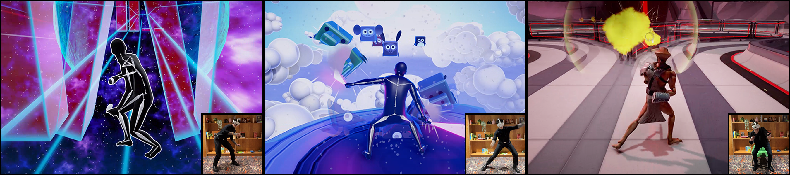

# AniNet: Deep Learning for Character Control

This repository explores the opportunities of deep learning for character animation and control. It aims to be a comprehensive framework for data-driven character animation, including data processing, neural network training, and runtime control, developed in Unity3D / PyTorch. The various projects below demonstrate such capabilities using neural networks for animating biped locomotion, quadruped locomotion, and character-scene interactions with objects and the environment, plus sports and fighting games, as well as embodied avatar motions in AR/VR. Further advances in this research will continue being added to this project.

---

**SIGGRAPH 2024**  
**Categorical Codebook Matching for Embodied Character Controllers**  

[**Sebastian Starke**](https://www.linkedin.com/in/sebastian-starke-b281a6148/), 
[**Paul Starke**](https://www.linkedin.com/in/paul-starke-0787211b4/), 
[**Nicky He**](https://www.linkedin.com/in/nicky-sijia-he-92240590/), 
[**Taku Komura**](https://www.linkedin.com/in/taku-komura-571b32b/), 
[**Yuting Ye**](https://www.linkedin.com/in/yuting-ye-77a75332/)  
_ACM Trans. Graph. 43, 4, Article 142_

Translating motions from a real user onto a virtual embodied avatar is a key challenge for character animation in the metaverse. In this work, we present a novel generative framework that enables mapping from a set of sparse sensor signals to a full body avatar motion in real-time while faithfully preserving the motion context of the user. In contrast to existing techniques that require training a motion prior and its mapping from control to motion separately, our framework is able to learn the motion manifold as well as how to sample from it at the same time in an end-to-end manner.

To achieve that, we introduce a technique called **codebook matching**, which matches the probability distribution between two categorical codebooks for the inputs and outputs for synthesizing the character motions. We demonstrate this technique can successfully handle ambiguity in motion generation and produce high-quality character controllers from unstructured motion capture data. Our method is especially useful for interactive applications like virtual reality or video games where high accuracy and responsiveness are needed.

---

### Resources
- [Video](https://youtu.be/NyLRcY0c0p4)
- [Paper](Media/SIGGRAPH_2024/Paper.pdf)
- [Dataset](https://starke-consult.de/AI4Animation/SIGGRAPH_2024/Cranberry_Dataset.zip)
- [Code](AI4Animation/SIGGRAPH_2024/)
- [VR Demo](https://starke-consult.de/AI4Animation/SIGGRAPH_2024/VR%20Demo.zip)
- [Windows Demo](https://starke-consult.de/AI4Animation/SIGGRAPH_2024/Demo_Win.zip)
- [Mac Demo](https://starke-consult.de/AI4Animation/SIGGRAPH_2024/Demo_Mac.zip)
- [ReadMe](AI4Animation/SIGGRAPH_2024/ReadMe.md)

---

**Note:** The remaining sections will follow the same format with all references updated to "AniNet."
